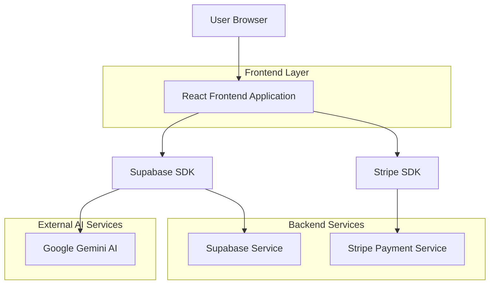
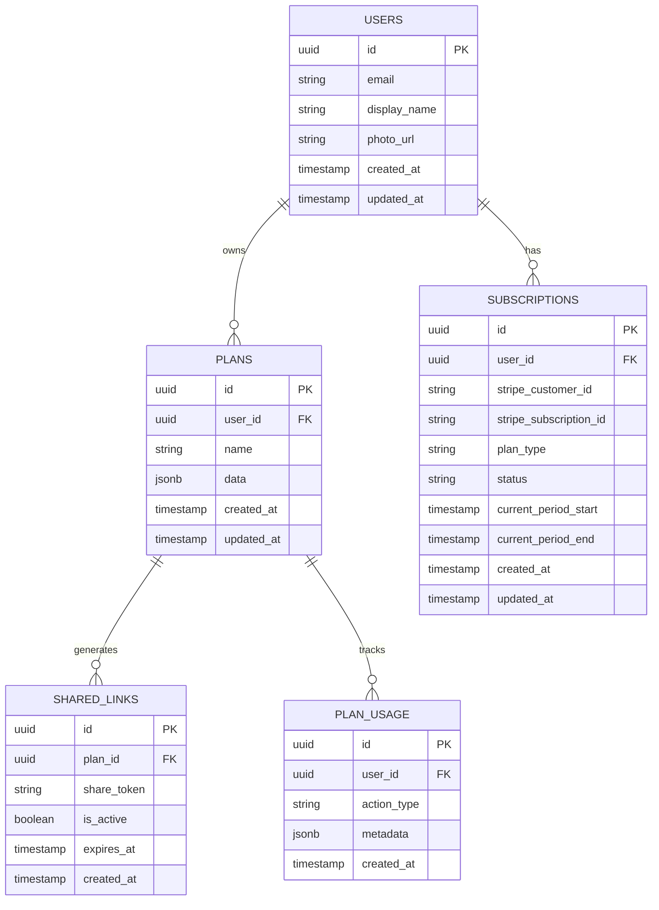

# Documento de Arquitetura Técnica - MasterPlan SaaS

## 1. Design da Arquitetura



## 2. Descrição das Tecnologias

* **Frontend**: React\@18 + TypeScript + TailwindCSS\@3 + Vite

* **Backend**: Supabase (PostgreSQL + Auth + Storage)

* **Pagamentos**: Stripe (Subscriptions + Checkout)

* **IA**: Google Gemini AI

* **Deploy**: Vercel (Frontend)

## 3. Definições de Rotas

| Rota                   | Propósito                                   |
| ---------------------- | ------------------------------------------- |
| /                      | Página inicial com login/registro           |
| /dashboard             | Dashboard principal com lista de planos     |
| /plan/:id              | Editor de plano específico                  |
| /plan/:id/overview     | Visão geral do plano                        |
| /plan/:id/month/:month | Detalhamento mensal                         |
| /tools/utm             | UTM Builder                                 |
| /tools/keywords        | Keyword Builder                             |
| /tools/copy            | Copy Builder                                |
| /tools/creative        | Creative Builder                            |
| /settings/profile      | Configurações de perfil                     |
| /settings/billing      | Gestão de assinatura e pagamentos           |
| /pricing               | Página de planos e upgrade                  |
| /share/:shareId        | Visualização pública de plano compartilhado |

## 4. Definições de API

### 4.1 APIs do Supabase

**Autenticação de usuários**

```typescript
// Supabase Auth
supabase.auth.signInWithOAuth({ provider: 'google' })
supabase.auth.signInWithPassword({ email, password })
supabase.auth.signOut()
```

**Gestão de planos**

```typescript
// Buscar planos do usuário
GET /rest/v1/plans?user_id=eq.{userId}

// Criar novo plano
POST /rest/v1/plans
Body: {
  user_id: string,
  name: string,
  data: PlanData,
  created_at: timestamp
}

// Atualizar plano
PATCH /rest/v1/plans?id=eq.{planId}
Body: { data: PlanData }
```

**Gestão de assinaturas**

```typescript
// Buscar assinatura do usuário
GET /rest/v1/subscriptions?user_id=eq.{userId}

// Atualizar status da assinatura
PATCH /rest/v1/subscriptions?user_id=eq.{userId}
Body: {
  stripe_subscription_id: string,
  plan_type: 'free' | 'pro' | 'ai',
  status: 'active' | 'canceled' | 'past_due'
}
```

### 4.2 APIs do Stripe

**Criar sessão de checkout**

```typescript
POST https://api.stripe.com/v1/checkout/sessions
Headers: { Authorization: 'Bearer sk_...' }
Body: {
  mode: 'subscription',
  line_items: [{
    price: 'price_pro_monthly', // ou price_ai_monthly
    quantity: 1
  }],
  success_url: 'https://app.masterplan.ai/dashboard?success=true',
  cancel_url: 'https://app.masterplan.ai/pricing'
}
```

**Webhook de eventos**

```typescript
POST /api/webhooks/stripe
Body: {
  type: 'customer.subscription.created' | 'customer.subscription.updated' | 'customer.subscription.deleted',
  data: {
    object: {
      id: string,
      customer: string,
      status: string,
      items: { data: [{ price: { id: string } }] }
    }
  }
}
```

### 4.3 APIs de IA (Gemini)

**Geração de plano com IA**

```typescript
POST https://generativelanguage.googleapis.com/v1/models/gemini-pro:generateContent
Headers: { 'x-goog-api-key': 'API_KEY' }
Body: {
  contents: [{
    parts: [{
      text: "Crie um plano de mídia para: {briefing}"
    }]
  }]
}
```

## 5. Modelo de Dados

### 5.1 Definição do Modelo de Dados



### 5.2 Linguagem de Definição de Dados

**Tabela de Usuários (users)**

```sql
-- Criar tabela de usuários (estende auth.users do Supabase)
CREATE TABLE public.users (
    id UUID PRIMARY KEY REFERENCES auth.users(id) ON DELETE CASCADE,
    email VARCHAR(255) NOT NULL,
    display_name VARCHAR(100),
    photo_url TEXT,
    created_at TIMESTAMP WITH TIME ZONE DEFAULT NOW(),
    updated_at TIMESTAMP WITH TIME ZONE DEFAULT NOW()
);

-- RLS (Row Level Security)
ALTER TABLE public.users ENABLE ROW LEVEL SECURITY;
CREATE POLICY "Users can view own profile" ON public.users FOR SELECT USING (auth.uid() = id);
CREATE POLICY "Users can update own profile" ON public.users FOR UPDATE USING (auth.uid() = id);

-- Permissões
GRANT SELECT, UPDATE ON public.users TO authenticated;
```

**Tabela de Assinaturas (subscriptions)**

```sql
CREATE TABLE public.subscriptions (
    id UUID PRIMARY KEY DEFAULT gen_random_uuid(),
    user_id UUID NOT NULL REFERENCES public.users(id) ON DELETE CASCADE,
    stripe_customer_id VARCHAR(255),
    stripe_subscription_id VARCHAR(255),
    plan_type VARCHAR(20) DEFAULT 'free' CHECK (plan_type IN ('free', 'pro', 'ai')),
    status VARCHAR(20) DEFAULT 'active' CHECK (status IN ('active', 'canceled', 'past_due', 'incomplete')),
    current_period_start TIMESTAMP WITH TIME ZONE,
    current_period_end TIMESTAMP WITH TIME ZONE,
    created_at TIMESTAMP WITH TIME ZONE DEFAULT NOW(),
    updated_at TIMESTAMP WITH TIME ZONE DEFAULT NOW()
);

-- RLS
ALTER TABLE public.subscriptions ENABLE ROW LEVEL SECURITY;
CREATE POLICY "Users can view own subscription" ON public.subscriptions FOR SELECT USING (auth.uid() = user_id);
CREATE POLICY "Users can update own subscription" ON public.subscriptions FOR UPDATE USING (auth.uid() = user_id);

-- Índices
CREATE INDEX idx_subscriptions_user_id ON public.subscriptions(user_id);
CREATE INDEX idx_subscriptions_stripe_customer ON public.subscriptions(stripe_customer_id);

-- Permissões
GRANT SELECT, INSERT, UPDATE ON public.subscriptions TO authenticated;
```

**Tabela de Planos (plans)**

```sql
CREATE TABLE public.plans (
    id UUID PRIMARY KEY DEFAULT gen_random_uuid(),
    user_id UUID NOT NULL REFERENCES public.users(id) ON DELETE CASCADE,
    name VARCHAR(255) NOT NULL,
    data JSONB NOT NULL DEFAULT '{}',
    created_at TIMESTAMP WITH TIME ZONE DEFAULT NOW(),
    updated_at TIMESTAMP WITH TIME ZONE DEFAULT NOW()
);

-- RLS
ALTER TABLE public.plans ENABLE ROW LEVEL SECURITY;
CREATE POLICY "Users can manage own plans" ON public.plans FOR ALL USING (auth.uid() = user_id);

-- Índices
CREATE INDEX idx_plans_user_id ON public.plans(user_id);
CREATE INDEX idx_plans_created_at ON public.plans(created_at DESC);
CREATE INDEX idx_plans_data_gin ON public.plans USING GIN(data);

-- Permissões
GRANT ALL PRIVILEGES ON public.plans TO authenticated;
```

**Tabela de Links Compartilhados (shared\_links)**

```sql
CREATE TABLE public.shared_links (
    id UUID PRIMARY KEY DEFAULT gen_random_uuid(),
    plan_id UUID NOT NULL REFERENCES public.plans(id) ON DELETE CASCADE,
    share_token VARCHAR(255) UNIQUE NOT NULL DEFAULT encode(gen_random_bytes(32), 'base64url'),
    is_active BOOLEAN DEFAULT true,
    expires_at TIMESTAMP WITH TIME ZONE,
    created_at TIMESTAMP WITH TIME ZONE DEFAULT NOW()
);

-- RLS
ALTER TABLE public.shared_links ENABLE ROW LEVEL SECURITY;
CREATE POLICY "Users can manage links for own plans" ON public.shared_links FOR ALL USING (
    EXISTS (SELECT 1 FROM public.plans WHERE plans.id = shared_links.plan_id AND plans.user_id = auth.uid())
);
CREATE POLICY "Anyone can view active shared links" ON public.shared_links FOR SELECT USING (is_active = true);

-- Índices
CREATE INDEX idx_shared_links_plan_id ON public.shared_links(plan_id);
CREATE INDEX idx_shared_links_token ON public.shared_links(share_token);

-- Permissões
GRANT SELECT ON public.shared_links TO anon;
GRANT ALL PRIVILEGES ON public.shared_links TO authenticated;
```

**Tabela de Uso (plan\_usage)**

```sql
CREATE TABLE public.plan_usage (
    id UUID PRIMARY KEY DEFAULT gen_random_uuid(),
    user_id UUID NOT NULL REFERENCES public.users(id) ON DELETE CASCADE,
    action_type VARCHAR(50) NOT NULL,
    metadata JSONB DEFAULT '{}',
    created_at TIMESTAMP WITH TIME ZONE DEFAULT NOW()
);

-- RLS
ALTER TABLE public.plan_usage ENABLE ROW LEVEL SECURITY;
CREATE POLICY "Users can view own usage" ON public.plan_usage FOR SELECT USING (auth.uid() = user_id);
CREATE POLICY "System can insert usage" ON public.plan_usage FOR INSERT WITH CHECK (true);

-- Índices
CREATE INDEX idx_plan_usage_user_id ON public.plan_usage(user_id);
CREATE INDEX idx_plan_usage_created_at ON public.plan_usage(created_at DESC);
CREATE INDEX idx_plan_usage_action_type ON public.plan_usage(action_type);

-- Permissões
GRANT SELECT, INSERT ON public.plan_usage TO authenticated;
```

**Função para atualizar timestamp**

```sql
CREATE OR REPLACE FUNCTION update_updated_at_column()
RETURNS TRIGGER AS $$
BEGIN
    NEW.updated_at = NOW();
    RETURN NEW;
END;
$$ language 'plpgsql';

-- Aplicar trigger nas tabelas relevantes
CREATE TRIGGER update_users_updated_at BEFORE UPDATE ON public.users
    FOR EACH ROW EXECUTE FUNCTION update_updated_at_column();
    
CREATE TRIGGER update_subscriptions_updated_at BEFORE UPDATE ON public.subscriptions
    FOR EACH ROW EXECUTE FUNCTION update_updated_at_column();
    
CREATE TRIGGER update_plans_updated_at BEFORE UPDATE ON public.plans
    FOR EACH ROW EXECUTE FUNCTION update_updated_at_column();
```

**Dados iniciais**

```sql
-- Inserir tipos de plano padrão (para referência)
INSERT INTO public.plan_usage (user_id, action_type, metadata) VALUES
('00000000-0000-0000-0000-000000000000', 'system_init', '{"plan_types": ["free", "pro", "ai"]}');
```

